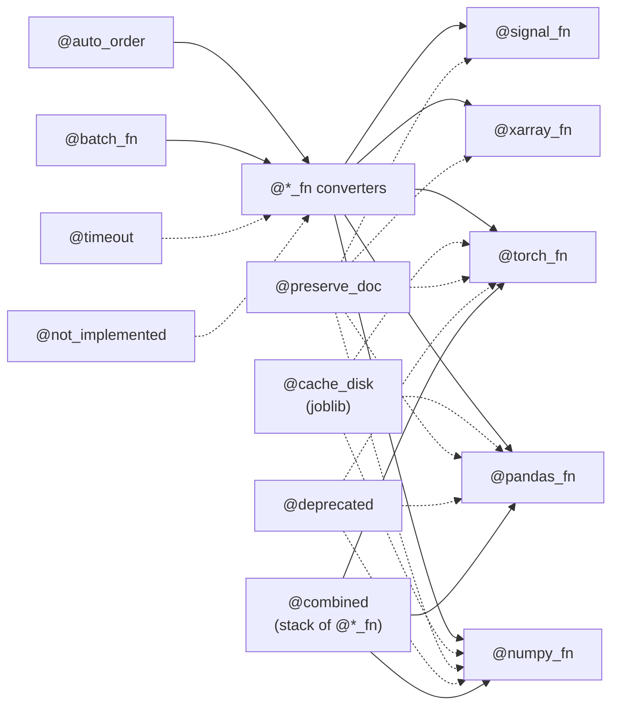
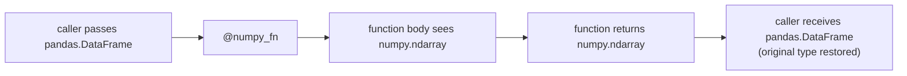

# scitex-decorators

<p align="center">
  <a href="https://scitex.ai">
    
  </a>
</p>

<p align="center"><b>Decorator library — type conversion (numpy/torch/pandas/xarray), caching, batching, lifecycle.</b></p>

<p align="center">
  <a href="https://scitex-decorators.readthedocs.io/">Full Documentation</a> · <code>pip install scitex-decorators</code>
</p>

<!-- scitex-badges:start -->
<p align="center">
  <a href="https://pypi.org/project/scitex-decorators/"></a>
  <a href="https://pypi.org/project/scitex-decorators/"></a>
  <a href="https://github.com/ywatanabe1989/scitex-decorators/actions/workflows/test.yml"></a>
  <a href="https://github.com/ywatanabe1989/scitex-decorators/actions/workflows/install-test.yml"></a>
  <a href="https://codecov.io/gh/ywatanabe1989/scitex-decorators"></a>
  <a href="https://scitex-decorators.readthedocs.io/en/latest/"></a>
  <a href="https://www.gnu.org/licenses/agpl-3.0"></a>
</p>
<!-- scitex-badges:end -->

---

## Installation

```bash
pip install scitex-decorators              # core (numpy only)
pip install "scitex-decorators[caching]"   # + joblib for cache_disk
pip install "scitex-decorators[torch]"     # + torch_fn / batch_torch_fn
pip install "scitex-decorators[all]"       # everything
```

## Architecture



Each `@<type>_fn` decorator converts inputs to the named type, calls the
wrapped function, then converts back to the caller's original type. The
diagram above shows how `_combined.py`, `_auto_order.py`, and the
caching/timeout decorators compose around the converter family.

## Quick Start

```python
import scitex_decorators as dec

@dec.numpy_fn
def kernel(x):
    return x ** 2     # x is numpy inside; return matches caller's type

@dec.cache_disk
def expensive(x): ...
```

## 1 Interfaces

<details open>
<summary><strong>Python API</strong></summary>

<br>

```python
import scitex_decorators as dec

# Type-conversion decorators
@dec.numpy_fn  ; @dec.torch_fn  ; @dec.pandas_fn  ; @dec.xarray_fn
@dec.signal_fn

# Caching (joblib for disk, dict for mem)
@dec.cache_disk        ; @dec.cache_disk_async    ; @dec.cache_mem

# Batching
@dec.batch_fn          ; @dec.batch_numpy_fn / batch_torch_fn / batch_pandas_fn

# Lifecycle
@dec.deprecated(reason="…")
@dec.not_implemented
@dec.preserve_doc
@dec.timeout(seconds=10)
@dec.wrap

# Auto-ordering machinery
dec.enable_auto_order() ; dec.disable_auto_order()

# Conversion helpers
dec.to_numpy(x) ; dec.to_torch(x)
dec.is_torch(x) ; dec.is_cuda(x)
```

</details>

## Cache directory resolution

`cache_disk` / `cache_disk_async` resolve the cache dir in this order:

1. `scitex.config.get_paths().function_cache` (only if scitex is installed)
2. `${SCITEX_CACHE_DIR}/function_cache`
3. `${XDG_CACHE_HOME}/scitex-decorators/function_cache`
4. `~/.cache/scitex-decorators/function_cache`

So the package works without the umbrella scitex installed.

## Demo



## Status

Standalone fork of `scitex.decorators`. Zero scitex.* runtime deps. The
umbrella package's `scitex.decorators` import path is preserved via a
`sys.modules`-alias bridge.

## Part of SciTeX

`scitex-decorators` is part of [**SciTeX**](https://scitex.ai). Install via
the umbrella with `pip install scitex[decorators]` to use as
`scitex.decorators` (Python) or `scitex decorators ...` (CLI).

>Four Freedoms for Research
>
>0. The freedom to **run** your research anywhere — your machine, your terms.
>1. The freedom to **study** how every step works — from raw data to final manuscript.
>2. The freedom to **redistribute** your workflows, not just your papers.
>3. The freedom to **modify** any module and share improvements with the community.
>
>AGPL-3.0 — because we believe research infrastructure deserves the same freedoms as the software it runs on.

## License

AGPL-3.0-only (see [LICENSE](./LICENSE)).

---

<p align="center">
  <a href="https://scitex.ai" target="_blank"></a>
</p>
